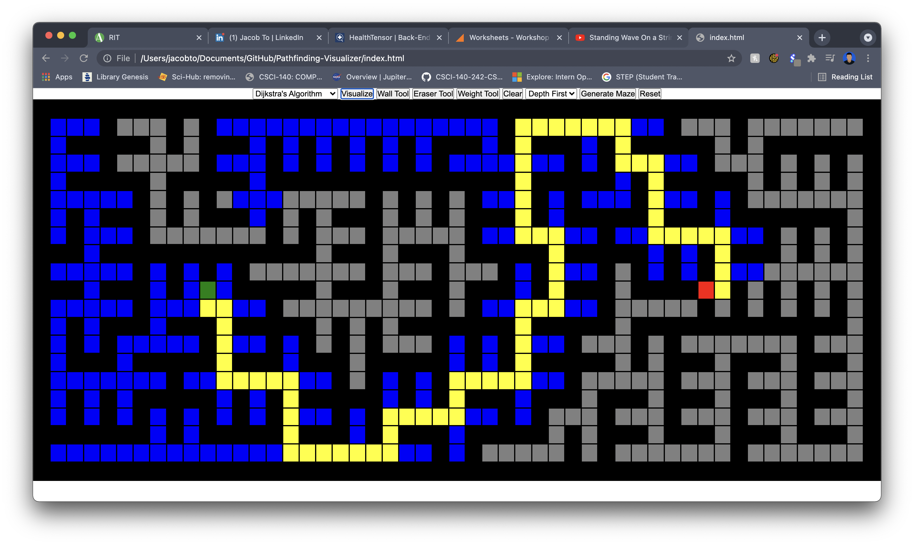

# Pathfinding-Visualizer
Web-based app to visualize pathfinding algorithms.

This app uses JavaScript to visualize pathfinding algorithms including Djikstra's, A Star, BFS, and DFS. It also implements maze generation through DFS. The weighted algorithms also support weights.
